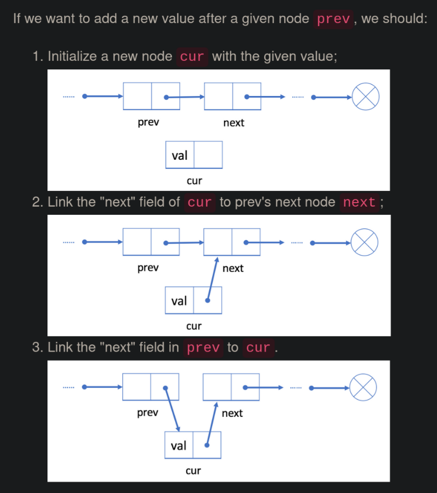
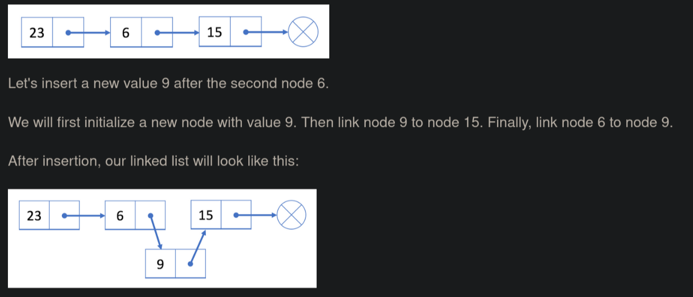
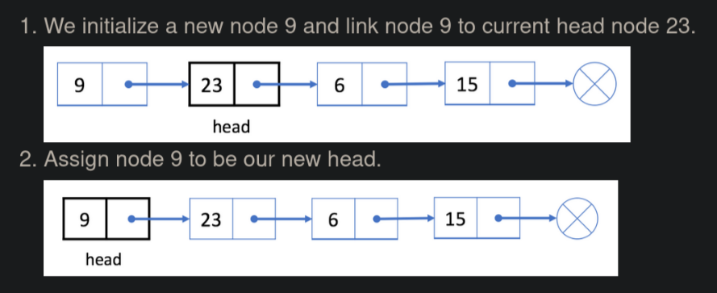
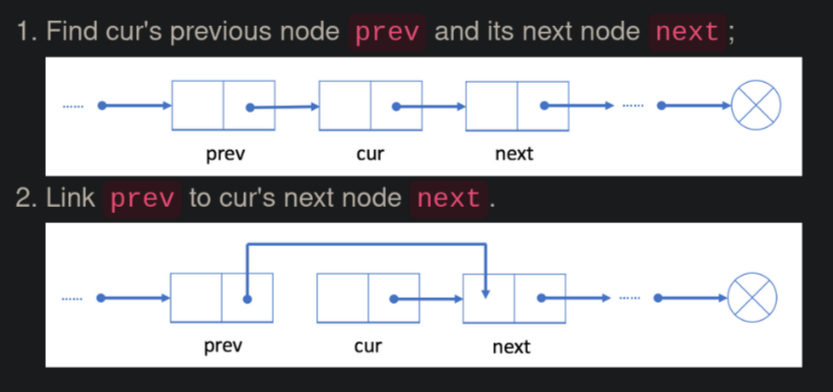
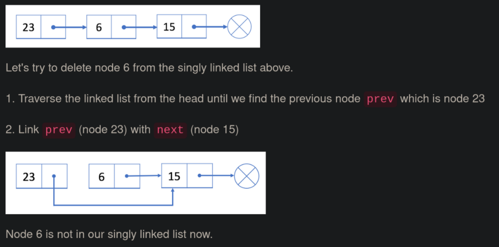
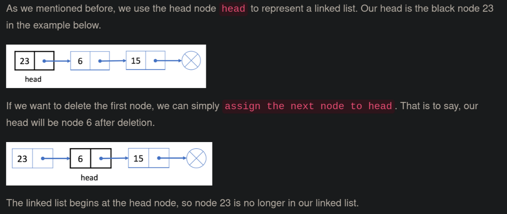

https://leetcode.com/explore/learn/card/linked-list/209/singly-linked-list/

# typical node definition

```cpp
// Definition for singly-linked list.
struct SinglyListNode {
    int val;
    SinglyListNode *next;
    SinglyListNode(int x) : val(x), next(NULL) {}
};
```

- in most cases, the **head** node is used to represent the whole list
- cannot access a random element in a singly linked list, must traverse from the head node one by one
    - unlike array, cannot access an element in constant time
    - if we want get to i<sup>th</sup> element, we need to traverse i steps from the head node
        - it takes $O(N)$ time on avg to visit an element by index, where *N* is the length of the linked list

# add operation



Unlike an array, we don't need to move all elements past the inserted element. Therefore, you can insert a new node into a linked list in $O(1)$ time complexity *if you have a reference to prev* (very efficient).

## ex.

 

## add a node at the beginning

- we use the *head* node to represent the whole list
- it is important to update *head* when adding a new node at the beginning of the list

## ex.

 

# delete operation

Deleting an existing node *cur* from a singly linked list can be done in two steps:

 

1. find *prev* and *next*
    - use reference field of cur to find *next*
    - traverse through list to from *head* to locate *prev* ($O(N)$ time)
2. link *prev* to *next*

Time complexity of deleting a node is $O(N)$ on average, where N is the length of the linked list. The space complexity is $O(1)$ because we only need constant space to store pointers.

## ex.

 

## delete the first node

 
